# Vibecoding Starter

**Project template for vibe coding with AI assistants. Works with Claude Code, Copilot & friends.**

[](https://opensource.org/licenses/MIT)

---

## ⚡ One-Line Install

Paste this into GitHub Copilot Chat or Claude Code:

```
Clone git@github.com:datorresb/vibecoding-starter.git to ./.references/vibecoding-starter then read and execute ./.references/vibecoding-starter/AGENT_START.md
```

That's it! The agent handles everything.

---

## ✨ What Is This?

A **project initializer** with pre-configured Agent Skills for AI-assisted development. Clone it once inside your repo under .references, use it for any project, keep it updated.

**Key Features:**

- ✅ **Ready to Use** — Skills already included, no downloads needed
- ✅ **Works Everywhere** — Claude Code, GitHub Copilot, and more
- ✅ **Batteries Included** — DevContainer, git hygiene, task management
- ✅ **Two Task Tools** — bd (CLI) or Backlog MCP (MCP server) — your choice
- ✅ **VS Code 1.109 Ready** — Subagents, orchestration, Agent Skills GA, Copilot Memory
- ✅ **Custom Agents** — Tech-lead orchestrator, code-simplifier, review-test
- ✅ **Extensible** — Create custom skills and agents for your workflow
- ✅ **Reusable** — One clone, use for all your projects

---

## 🗺️ How It Works

### Setup → Workflow


### Skills Architecture

```mermaid
flowchart LR
    subgraph SKILLS["Skills Categories"]
        direction TB
        CORE["🔧 Core\nbd, git, subagent\nbrainstorming\nbacklog-workflow\ntask-delegation"]
        ENG["⚙️ Engineering\nrefactoring, tdd\ncode-review\ntesting-strategy"]
        DEVOPS["🚀 DevOps\nci-cd, deployment\ndevcontainer-setup"]
        DOCS["📝 Documentation\ntechnical-writing\napi-documentation, adr"]
        RES["🔬 Research\ntechnical-research\nevaluation, poc"]
    end

    AGENT["🤖 AI Agent"] -->|"1. Read"| INDEX["skills-index.json"]
    INDEX -->|"2. Find"| SKILLS
    SKILLS -->|"3. Load SKILL.md"| AGENT
    AGENT -->|"4. Execute"| OUTPUT["Code, Docs,\nTests, Config"]
```



### Tech Lead / Subagent Model

```mermaid
flowchart TB
    USER["👤 You"] -->|"Describe what\nyou want"| TL["🧠 tech-lead.agent.md\n(Orchestrator)"]
    TL -->|"Clarify"| AQ["❓ ask_questions"]
    TL -->|"Plan"| PLAN["📋 Plan Agent\n(/plan command)"]
    TL -->|"Track"| TODO["✅ manage_todo_list"]
    TL -->|"Delegate\n(parallel)"| SA1["⚡ code-simplifier\nRefactor & clean"]
    TL -->|"Delegate\n(parallel)"| SA2["⚡ review-test\nReview & test"]
    TL -->|"Delegate"| SA3["⚡ Custom Subagent\n(your .agent.md)"]
    SA1 -->|"Result"| TL
    SA2 -->|"Result"| TL
    SA3 -->|"Result"| TL
    TL -->|"Present\nresults"| USER

    style TL fill:#f9f,stroke:#333
    style SA1 fill:#bbf,stroke:#333
    style SA2 fill:#bbf,stroke:#333
    style SA3 fill:#bfb,stroke:#333
```



---

## 🚀 Quick Start

### Option A: Let the Agent Do Everything (Recommended)

Paste into your AI assistant:

```
Clone git@github.com:datorresb/vibecoding-starter.git to ./.references/vibecoding-starter then read and execute ./.references/vibecoding-starter/AGENT_START.md
```

### Option B: Manual Clone + Agent Setup

```bash
# 1. Clone inside the repo for DevContainer use
git clone git@github.com:datorresb/vibecoding-starter.git ./.references/vibecoding-starter

# 2. Go to your project
cd /path/to/your-project

# 3. Tell your agent
```

```
Read and execute ./.references/vibecoding-starter/AGENT_START.md
```

The agent will:
- Ask a few questions about your setup
- Copy skills to your project
- Configure everything automatically

> **Note:** The initializer stays in `.references/vibecoding-starter/` — no cleanup needed. Update anytime with `cd ./.references/vibecoding-starter && git pull`.

---

### Alternative: Use as GitHub Template

> ⚠️ **Different workflow:** When using GitHub's "Use this template" feature, the skills are already in your new repo. You don't need to clone the initializer—your repo IS the initializer.

```bash
# After clicking "Use this template" on GitHub:
git clone git@github.com:YOUR_USERNAME/my-new-project.git
cd my-new-project

# Skills are already here! Just tell your agent:
# "Read and execute AGENT_START.md"
```

---

## � Updating Skills

Update the local initializer:

```bash
cd ./.references/vibecoding-starter && git pull
```

Update skills in your current project:

```
Update my vibecoding-starter skills to the latest version
```

Your agent will:
- Pull latest from `.references/vibecoding-starter/`
- Backup your current skills
- Merge or replace (your choice)

---

## �📚 What's Included
### Custom Agents (`.github/agents/`)

| Agent | Role | Invocation |
|-------|------|------------|
| **tech-lead** | Orchestrator — plans, delegates, reviews. Never edits files. | User-invokable + subagent |
| **code-simplifier** | Refactors code for clarity and consistency | User-invokable + subagent |
| **review-test** | Reviews Python code and writes unit tests | User-invokable + subagent |

All agents can run as **parallel subagents** via `chat.customAgentInSubagent.enabled`.
### Skills Directory

Pre-configured skills in `.claude/skills/`:

| Category | Skills |
|----------|--------|
| **Core** | bd, backlog-workflow, git, subagent, brainstorming, code-review, code-simplifier, creating-skills, session-continuation, task-delegation, technical-lead-role, testing-strategy |
| **Engineering** | refactoring, tdd, architecture-review, performance-optimization |
| **DevOps** | devcontainer-setup, ci-cd, deployment, infrastructure, monitoring |
| **Documentation** | technical-writing, api-documentation, adr |
| **Research** | technical-research, evaluation, proof-of-concept |

### Key Files

| File | Purpose |
|------|---------|
| [AGENTS.md](AGENTS.md) | Workflow instructions for AI agents |
| [AGENT_START.md](AGENT_START.md) | Automated setup runbook |
| [SKILL_SELECTOR.md](SKILL_SELECTOR.md) | Help choosing which skills to use |

---

## 🛠️ DevContainer Support

This template includes DevContainer configuration:

```bash
# Using the devcontainer-setup skill
# Just ask your AI: "Set up a DevContainer for this project"
```

Features: Docker-in-Docker, GitHub CLI, Node.js tooling, secrets management.

---

## 🎯 How Skills Work

Skills are markdown files that teach AI agents specialized capabilities:

1. **Agent reads AGENTS.md** — Understands the workflow
2. **Agent loads relevant skills** — Based on the task at hand
3. **Agent follows skill instructions** — Executes with consistency
4. **You review and iterate** — Vibe coding at its finest

### Example Skills Usage

```plaintext
# Ask your AI assistant:
"Use the agent-runbook skill to create a deployment runbook"

"Use the devcontainer-setup skill to configure my environment"

"Use the refactoring skill to improve this module"
```

---

## 📂 Directory Structure

```
.
├── .claude/
│   └── skills/              # Agent Skills (35+ skills)
│       ├── core/            # Essential skills
│       ├── devops/          # DevOps skills
│       ├── engineering/     # Engineering skills
│       ├── documentation/   # Documentation skills
│       ├── research/        # Research skills
│       └── assimilation/    # Repo assimilation skills
├── .github/
│   ├── agents/              # VS Code Custom Agents (.agent.md)
│   │   ├── tech-lead.agent.md
│   │   ├── code-simplifier.agent.md
│   │   └── review-test.agent.md
│   ├── copilot-instructions.md  # Copilot safety rules
│   └── prompts/             # Reusable prompt files (.prompt.md)
├── .vscode/
│   └── settings.json        # VS Code 1.109 agent settings
├── AGENTS.md                # Agent workflow instructions
├── AGENT_START.md           # Automated setup runbook
└── README.md                # This file
```

---

## 🔧 Customization

### Adding Your Own Skills

Use the `creating-skills` skill:

```plaintext
"Create a new skill for [your use case]"
```

Skills are stored in `.claude/skills/[category]/[skill-name]/SKILL.md`.

VS Code discovers skills from both `.github/skills/` and `.claude/skills/` natively (v1.109+). Additional paths can be configured via `chat.agentSkillsLocations`.

### Adding Custom Agents

Create `.agent.md` files in `.github/agents/`:

```markdown
---
name: my-agent
description: What this agent does
model: ['Claude Opus 4.6', 'Claude Sonnet 4.5 (copilot)']
tools: ['agent']
agents: ['code-simplifier', 'review-test']
user-invokable: true
---

Your agent instructions here.
```

Key frontmatter options (VS Code 1.109):
- `model` — List of models with fallback order
- `agents` — Which subagents this agent can invoke
- `user-invokable` — Show in agents dropdown (`false` = subagent-only)
- `disable-model-invocation` — Prevent other agents from invoking this one

### Creating Runbooks

Use the `agent-runbook` skill to create executable guides:

```plaintext
"Create a runbook for setting up our CI/CD pipeline"
```

### Need More Skills or Agents?

- **[Awesome Copilot](https://github.com/github/awesome-copilot)** — Curated list of resources, extensions, and agent skills for GitHub Copilot
- **[skills.sh](https://skills.sh/)** — Community-driven directory of agent skills
- **[Copilot Orchestra](https://github.com/ShepAlderson/copilot-orchestra)** — Multi-agent orchestration system example
- **[Copilot Atlas](https://github.com/bigguy345/Github-Copilot-Atlas)** — Extended orchestration with specialized agents

---

## 🤝 Contributing

1. Fork the repository
2. Create your feature branch (`git checkout -b feature/amazing`)
3. Commit your changes (`git commit -m 'Add amazing feature'`)
4. Push to the branch (`git push origin feature/amazing`)
5. Open a Pull Request

---

## ❓ FAQ

**Q: How do skills activate?**
A: Automatically when relevant, or explicitly referenced in your prompt.

**Q: Can I use this with any AI assistant?**
A: Yes! Skills are standard markdown files readable by any AI coding assistant.

**Q: How do I create custom skills?**
A: Use the `creating-skills` skill as your guide.

---

## 📄 License

MIT License - see [LICENSE](LICENSE) for details.

---

## ⚙️ VS Code 1.109 Features

This repo pre-configures the following VS Code 1.109 agent features (in `.vscode/settings.json`):

| Feature | Setting | What It Does |
|---------|---------|-------------|
| **Subagents** | `chat.customAgentInSubagent.enabled` | Custom agents can invoke each other as subagents |
| **Search Subagent** | `github.copilot.chat.searchSubagent.enabled` | Dedicated agent for codebase search (preserves main context) |
| **Ask Questions** | `chat.askQuestions.enabled` | Agent asks clarifying questions via native UI |
| **Copilot Memory** | `github.copilot.chat.copilotMemory.enabled` | Persist learnings across sessions |
| **Thinking Tokens** | `github.copilot.chat.anthropic.thinking.budgetTokens` | See Claude's reasoning process |
| **Context Editing** | `github.copilot.chat.anthropic.contextEditing.enabled` | Better long-conversation management |
| **Tool Search** | `github.copilot.chat.anthropic.toolSearchTool.enabled` | Smarter tool selection from large tool pools |
| **Terminal Sandbox** | `chat.tools.terminal.sandbox.enabled` | Restrict agent terminal commands to workspace |
| **Skills Locations** | `chat.agentSkillsLocations` | Discover skills in `.claude/skills/` |
| **Org Instructions** | `github.copilot.chat.organizationInstructions.enabled` | Apply org-level Copilot instructions |

Also useful:
- **`/plan`** — Built-in Plan agent with 4-phase workflow (Discovery → Alignment → Design → Refinement)
- **`/init`** — Generate or update workspace AI instructions from your codebase
- **Chat Diagnostics** — Right-click in Chat → "Diagnostics" to troubleshoot loaded agents/skills

---

**Last Updated:** 2026-02-06
**Version:** 0.4
